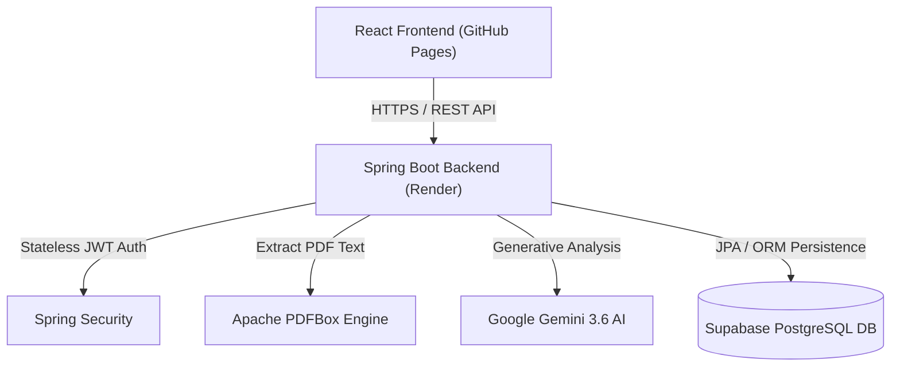

# 📄 OFFICIAL PROJECT REPORT

---

# **ATS RESUME ANALYZER**
### *An AI-Powered Applicant Tracking System & Resume Optimization Platform*

**Author:** Arpit Jain  
**Email:** `jainarpitmoz@gmail.com`  
**GitHub Repository:** [https://github.com/Arpitjain70/Resume-Analyzer](https://github.com/Arpitjain70/Resume-Analyzer)  
**Live Application URL:** [https://arpitjain70.github.io/Resume-Analyzer/](https://arpitjain70.github.io/Resume-Analyzer/)  
**Backend API Service:** `https://resume-analyzer-backend.onrender.com`  

---

## 1. Executive Summary / Abstract

Modern recruitment workflows rely heavily on Applicant Tracking Systems (ATS) to filter candidate resumes before human evaluation. Most candidates fail at the initial screening phase due to poor formatting, unoptimized keyword usage, missing technical competencies, or improper document layout.

The **ATS Resume Analyzer** is an end-to-end, full-stack web application designed to bridge this gap. Candidates can upload PDF resumes, which are automatically parsed using **Apache PDFBox**, evaluated against modern recruitment metrics via **Google Gemini 3.6 AI**, and scored on an interactive scale (0–100). The system provides structured candidate parsing (contact details, education, experience, skills, projects) alongside detailed actionable feedback, including top resume red flags, personalized improvement strategies, and missing role-specific competencies.

---

## 2. System Objectives & Scope

### Primary Objectives:
1. **Automated Resume Parsing:** Extract text accurately from user-submitted PDF files without data loss.
2. **AI-Driven ATS Scoring:** Use Google Gemini 3.6 AI model to generate deterministic scoring for overall match, formatting, skill alignment, and experience depth.
3. **Actionable Feedback Engine:** Output top 5 critical resume problems, personalized recommendations, and missing technical skills.
4. **Enterprise Security:** Implement stateless **JWT (JSON Web Token)** authentication with **BCrypt** password encryption.
5. **Multi-Tenant Persistence:** Store user accounts, uploaded resume metadata, and historical analysis records in a cloud-hosted **Supabase PostgreSQL** database.

---

## 3. Technology Stack

| Layer | Technology | Version / Specification |
|---|---|---|
| **Frontend Framework** | React.js | v18.3.1 |
| **Frontend Build Tool** | Vite | v5.3.1 |
| **Styling & UI** | Vanilla CSS + Tailwind CSS | v3.4.6 |
| **HTTP Client** | Axios | v1.7.2 |
| **Backend Runtime** | Java OpenJDK | 17 LTS |
| **Backend Framework** | Spring Boot | v3.2.5 |
| **Security & Auth** | Spring Security + JJWT | v0.11.5 (BCrypt Hashing) |
| **PDF Parsing Engine** | Apache PDFBox | v3.0.2 |
| **Database** | Supabase PostgreSQL | Managed Cloud Postgres |
| **AI Intelligence** | Google Gemini AI | `gemini-3.6-flash` |
| **Deployment & CI/CD** | GitHub Pages + Render + Docker | Dockerized Spring Boot |

---

## 4. System Architecture & Data Flow



### Flow Breakdown:
1. **User Request:** User registers/logs in and uploads a PDF resume on the React frontend.
2. **Authentication:** Spring Security validates the incoming JWT bearer token.
3. **Text Extraction:** `PdfTextExtractor` reads raw text characters from the saved PDF file using Apache PDFBox.
4. **AI Intelligence Pipeline:** `GeminiService` constructs a structured JSON prompt and sends it to `gemini-3.6-flash` with native JSON output enforcement (`responseMimeType: application/json`, `maxOutputTokens: 8192`).
5. **Persistence & Response:** Results are stored in Supabase (`resumes` and `resume_analysis` tables) and returned to the React frontend.

---

## 5. Database Schema & ER Design

The system utilizes three core relational entities managed via Spring Data JPA and Hibernate:

```
+-------------------+       +-----------------------+       +------------------------+
|       users       |       |        resumes        |       |    resume_analysis     |
+-------------------+       +-----------------------+       +------------------------+
| PK id (BigInt)    |<----1:| PK id (BigInt)        |<----1:| PK id (BigInt)         |
|    name (VarChar) |    N  | FK user_id (BigInt)   |    1  | FK resume_id (BigInt)  |
| UQ email (VarChar)|       |    original_file_name |       |    ats_score (Int)     |
|    password (Hash)|       |    file_path          |       |    parsed_json (TEXT)  |
|    created_at     |       |    ats_score (Int)    |       |    suggestions_json    |
+-------------------+       |    created_at         |       +------------------------+
                            +-----------------------+
```

---

## 6. Key Features & Implementation Highlights

### A. Stateless JWT Authentication
- Passwords stored as one-way BCrypt hashes.
- JWT tokens signed using 256-bit secret key with 24-hour expiration.
- Auto-logout interceptor handles expired tokens gracefully.

### B. High-Precision PDF Parsing
- Handles multi-page PDFs cleanly using `Loader.loadPDF()`.
- Captures formatting order (`setSortByPosition(true)`).

### C. Robust AI Integration
- Native JSON response enforcement prevents syntax errors.
- Automatic rate limit retry and model fallback handling.

---

## 7. API Endpoint Summary

| Endpoint | Method | Security | Description |
|---|---|---|---|
| `/api/auth/register` | `POST` | Public | Register new user account |
| `/api/auth/login` | `POST` | Public | Authenticate user & return JWT token |
| `/api/resume/upload` | `POST` | JWT Required | Upload PDF & run AI ATS analysis |
| `/api/resume/history` | `GET` | JWT Required | Fetch user's upload history |
| `/api/resume/{id}/analysis` | `GET` | JWT Required | Fetch detailed AI analysis for resume ID |

---

## 8. Deployment Strategy

1. **Frontend Deployment:** Automated via GitHub Actions workflow (`.github/workflows/deploy.yml`) deploying React Vite build output to **GitHub Pages**.
2. **Backend Deployment:** Containerized via multi-stage **Dockerfile** running on **Render**.
3. **Database Hosting:** Managed **Supabase PostgreSQL** cloud instance connected over IPv4 pooler connection strings.

---

## 9. Conclusion

The **ATS Resume Analyzer** provides an intuitive, high-performance solution to resume evaluation. By combining modern web design (React), enterprise security (Spring Security + JWT), cloud data persistence (Supabase), and AI evaluation (Google Gemini 3.6), the platform empowers job applicants to significantly improve their resume quality and recruitment success rate.
